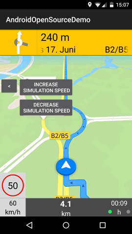
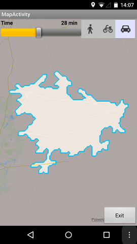
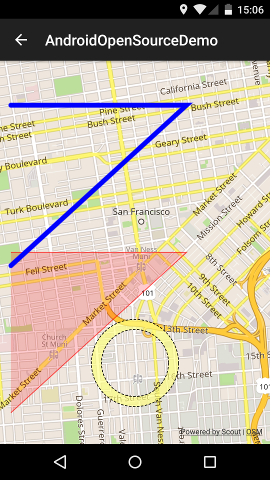

Xamarin.Android.Skobbler
========================

## C#  bindings for the Skobbler Android SDK ##

I am not associated with either [Skobbler](http://www.skobbler.com/) or [Xamarin .inc](http://xamarin.com/). All rights belong to their respective owners.

This repository includes a C# translation of the demo included with the Skobbler SDK. This currently has a few small bugs which are probably a result of my [mis]translation. Raise an issue or send a pull request if you would like these fixed ASAP.

**Xamarin.Android.Skobbler currently uses v2.4.0 of the Skobbler Android SDK**

## Installation ##

1. Clone the repo.
2. Build the Skobbler.Binding project.
3. Reference "Skobbler.dll" from your project; found under `"Xamarin.Android.Skobbler\src\Skobbler\bin\[Debug|Release][-$ABI]\Skobbler.dll"`

There are platform configurations for each native library ABI (`x86`, `armeabi-v7a` & `armeabi`). The `AnyCPU` platform configuration includes all 3 ABIs at the cost of a larger assembly (~5MB for specific platforms and ~11MB for AnyCPU). If you don't know which platform to select just use `AnyCPU`.

**The Skobbler sdk requires you to have a string resource called "app_name", which your manifest's application label points at. If you do not add this your app will crash on initialization.**

ie. in `Resources\values\Strings.xml`

    <resources>
    	...
      <string name="app_name">AndroidOpenSourceDemo</string>
		...
    </resources>
and in `Properties\AndroidManifest.xml`

    <?xml version="1.0" encoding="utf-8"?>
    <manifest xmlns:android="http://schemas.android.com/apk/res/android" ... >
    	<application android:label="@string/app_name" ... ></application>
      ...
    </manifest>

## Documentation ##

Fantastic documentation is [available from Skobbler](http://developer.skobbler.com/getting-started/android). The main difference you will find is that get/set method pairs in Java have been changed to  C# properties. The automatic binding generation process will also add events that correspond to callback interfaces.

## Assets ##

You will need to manually copy the SKMaps.zip file to your assets folder, with a build configuration of an Android asset. The zip is available in the Android SDK from [Skobbler](http://developer.skobbler.com/support#download). See the demo app for an example.

## Additions & Alterations ##

I have added `async/await` methods to make things cleaner and more .NET friendly should you wish to use them. Here's an example using `NearbySearchAsync()` instead of `NearbySearch()`:

    try
    {
    	var searchManager = new SKSearchManager(); //No listener needed in the constructor for async calls;
    	IList<SKSearchResult> results = await searchManager.NearbySearchAsync(searchObj);
    }
	catch(SKSearchStatusException)
	{
		//Catch invalid search status here.
	}
    
Namespaces should be the same as their respective Java packages, minus the `com` prefix and capitalization.

## Demo App Screenshots ##

## Contributing ##
If you would like to add a feature or fix a known issue, please add any contributions to the `develop` branch and raise a pull request.

## License ##
The Bindings, SDKTools and SDKDemo are provided under the MIT license. See LICENSE for details.

## Thanks ##
[Skobbler](http://www.skobbler.com/)

[Open Street Maps](http://www.openstreetmap.org/)

[Xamarin inc.](http://xamarin.com/)